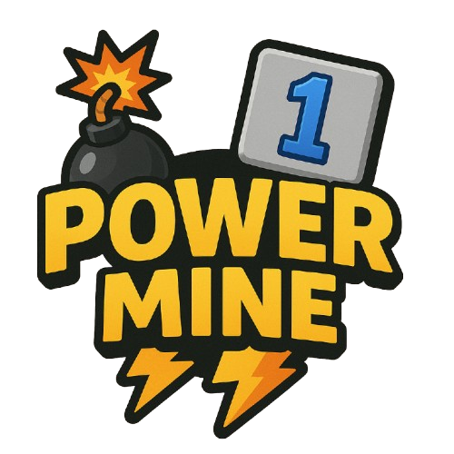
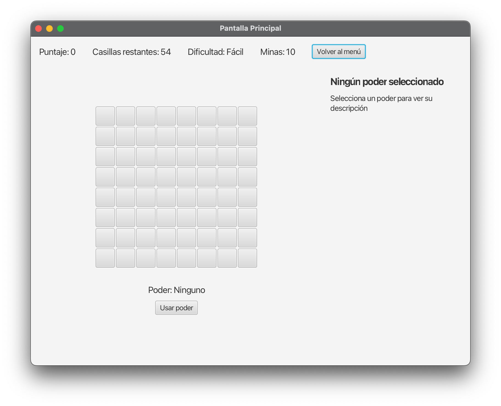
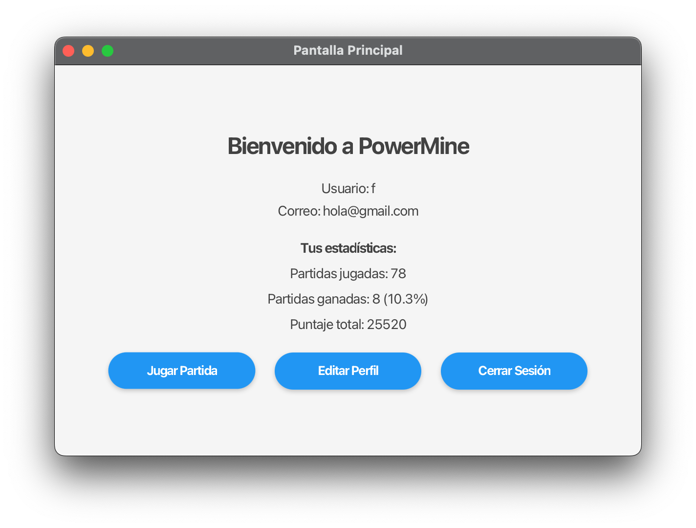

<div align="center">

# 💣 PowerMine

*Una versión evolucionada del clásico Buscaminas con poderes especiales y sistema de ranking*



[](https://www.oracle.com/java/technologies/javase/jdk17-archive-downloads.html)
[](https://openjfx.io/)
[](LICENSE)

[Características](#✨-características) •
[Instalación](#🚀-instalación) •
[Cómo Jugar](#🎮-cómo-jugar) •
[Poderes](#⚡-poderes) •
[Contribuir](#🤝-contribuir)

</div>

## ✨ Características

- 🎯 **Tres niveles de dificultad** ajustables
- 🎭 **Sistema de poderes únicos** para una jugabilidad estratégica
- 🏆 **Tabla de clasificación** con los mejores jugadores
- 💾 **Guardado automático** del progreso
- 🎨 **Interfaz moderna** y animaciones fluidas

## 📸 Capturas del Juego

| Tablero de Juego | Menú Principal |
|:--------:|:--------:|
|  |  |

## 🚀 Instalación

```bash
git clone https://github.com/tuusuario/PowerMine.git
cd PowerMine
mvn clean install
mvn javafx:run
```

## 🎮 Cómo Jugar

1. **Regístrate o inicia sesión** para comenzar
2. **Selecciona la dificultad**:
   - Fácil: 8x8, 10 minas
   - Medio: 12x12, 20 minas
   - Difícil: 14x14, 30 minas
3. **Usa el ratón** para revelar casillas:
   - Click izquierdo: Revelar casilla
   - Click derecho: Marcar mina
4. **Consigue poderes** revelando casillas especiales
5. **Gana** revelando todas las casillas seguras

## ⚡ Poderes

| Poder | Descripción |
|-------|-------------|
| 🔍 Radar | Revela la ubicación de minas cercanas |
| 🛡️ Escudo | Protege casillas aleatorias con minas |
| 💪 Desminador | Elimina una mina aleatoria del tablero |
| 👁️ Visión | Revela una zona segura garantizada |
| 🌊 Tsunami | Limpia toda una fila de minas |
| 🌋 Terremoto | Limpia toda una columna de minas |


<div align="center">

---

Desarrollado con ❤️ por [franciscorodalf](https://github.com/franciscorodalf)

</div>
